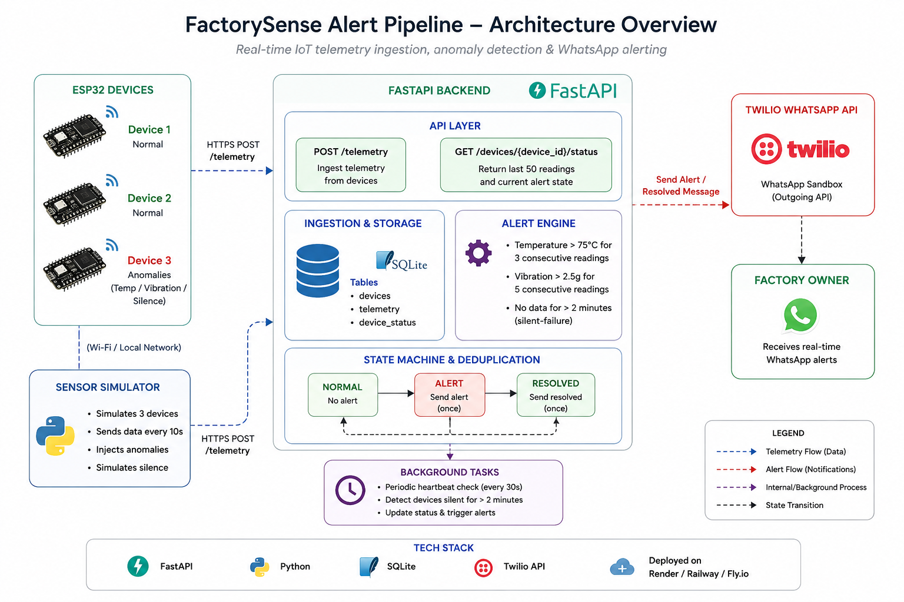

# FactorySense Alert Pipeline

A scalable IoT telemetry and alerting backend designed for real-time industrial sensor monitoring. FactorySense ingests telemetry from ESP32-based devices, persists high-frequency sensor readings, detects abnormal operating conditions using a persistent state machine, and dispatches deduplicated WhatsApp alerts through Twilio.

The system is designed around durable state persistence, explicit alert-state transitions, and defensive deduplication to ensure reliable behavior under noisy real-world telemetry conditions.

---

## 🏗️ Architecture



---

## 🚀 Features

* **Real-Time Telemetry Ingestion**
  FastAPI-based backend optimized for continuous sensor data ingestion.

* **Persistent Alert State Machine**
  Uses streak-based threshold detection with durable state persistence to prevent duplicate or spurious alerts.

* **WhatsApp Alerting via Twilio**
  Sends real-time trigger and resolution notifications directly to the factory owner.

* **Silent-Failure Detection**
  Background scheduler continuously monitors device heartbeat activity and detects telemetry outages automatically.

* **Audit Logging**
  Every alert event is permanently stored in SQLite for traceability and debugging.

* **Multi-Device Simulator**
  Includes a telemetry simulator capable of generating realistic sensor noise, anomaly spikes, and silent-device scenarios.

* **Deployment Ready**
  Environment-variable-driven configuration for secure deployment on Render, Railway, or Fly.io.

---

## 📂 Project Structure

```text
factorysense-alert-pipeline/
│
├── backend/
│   ├── __init__.py
│   ├── main.py              # FastAPI application entry point
│   ├── database.py          # SQLAlchemy engine and session setup
│   ├── models.py            # Database table definitions
│   ├── schemas.py           # Pydantic request/response schemas
│   ├── crud.py              # Database operations layer
│   ├── alert_engine.py      # Alert state transitions and detection logic
│   ├── scheduler.py         # Silent-failure monitoring background task
│   ├── simulator.py         # Multi-device telemetry simulator
│   ├── utils.py             # Twilio integration and utility helpers
│   ├── .env.example         # Example environment variables
│   └── .gitignore
│
├── assets/
│   └── architecture.png
│
├── requirements.txt
├── README.md
├── DECISIONS.md
└── .gitignore
```

---

## ⚙️ Alert Conditions

The system generates alerts under the following conditions:

| Alert Type     | Trigger Condition                               |
| -------------- | ----------------------------------------------- |
| **TEMP_ALERT** | Temperature > 75°C for 3 consecutive readings   |
| **VIB_ALERT**  | Vibration > 2.5g for 5 consecutive readings     |
| **SILENT**     | No telemetry received for more than 120 seconds |

### Deduplication Behavior

* A trigger alert is sent exactly once when entering an alert state.
* Duplicate alerts are suppressed while the device remains in that state.
* A resolved message is sent exactly once when the device returns to normal.

---

## 🛠️ Setup & Installation

### 1. Clone the repository

```bash
git clone https://github.com/Annamlikhitha/factorysense-alert-pipeline.git
cd factorysense-alert-pipeline
```

### 2. Install dependencies

Ensure Python 3.10+ is installed.

```bash
pip install -r requirements.txt
```

### 3. Configure environment variables

Create a `.env` file inside the `backend/` directory using `.env.example`.

```bash
cd backend
cp .env.example .env
```

Update `.env` with your Twilio credentials:

```env
TWILIO_ACCOUNT_SID=your_twilio_account_sid
TWILIO_AUTH_TOKEN=your_twilio_auth_token
WHATSAPP_FROM=whatsapp:+14155238886
WHATSAPP_TO=whatsapp:+91xxxxxxxxxx
ALERT_COOLDOWN=60
DATABASE_URL=sqlite:///./factory.db
```

---

## ▶️ Running the Backend

Start the FastAPI development server:

```bash
cd backend
uvicorn main:app --reload
```

The API will be available at:

```text
http://127.0.0.1:8000
```

Interactive Swagger documentation:

```text
http://127.0.0.1:8000/docs
```

---

## 🧪 Running the Simulator

In a separate terminal:

```bash
cd backend
python simulator.py
```

The simulator emulates three ESP32 devices:

* Device 1 → Normal operating range
* Device 2 → Normal operating range
* Device 3 → Injected anomaly scenarios:

  * High temperature
  * High vibration
  * Silent failure

---

## 📡 API Endpoints

| Method | Endpoint                      | Description                                  |
| ------ | ----------------------------- | -------------------------------------------- |
| POST   | `/telemetry`                  | Ingest sensor telemetry                      |
| GET    | `/devices`                    | List all devices and current states          |
| GET    | `/devices/{device_id}/status` | Retrieve latest 50 readings and device state |
| GET    | `/alerts`                     | Retrieve recent alert history                |
| GET    | `/health`                     | Basic service health check                   |

---

## 🌐 Deployment

The backend is publicly deployed for testing and demonstration.

### Live API

`<YOUR_RENDER_URL>`

### Interactive API Documentation

`<YOUR_RENDER_URL>/docs`

---

## 🎥 Demo

Complete walkthrough and live end-to-end alert demonstration:

`<YOUR_LOOM_VIDEO_LINK>`

The demo includes:

* telemetry ingestion
* anomaly detection
* state transitions
* alert deduplication
* WhatsApp notifications
* silent-failure monitoring

---

## 🚧 Future Improvements

Potential production-scale enhancements include:

* Migration from SQLite to TimescaleDB
* Redis-backed state caching
* Asynchronous worker queues for alert delivery
* Structured logging and metrics collection
* Authentication and API rate limiting
* Distributed silence-monitoring workers
